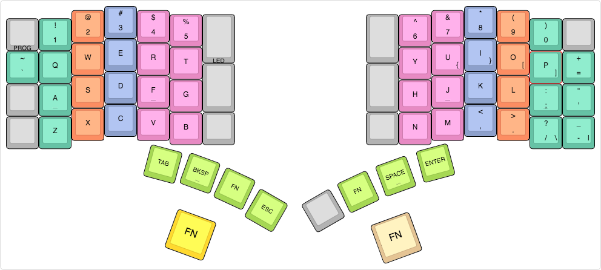

# Josh Rule's Keyboardio Model 01 Firmware Sketch

This is [Josh Rule]'s work-in-progress personalized firmware sketch for the [Keyboardio Model 01].

[](http://www.keyboard-layout-editor.com/#/gists/38d7ebfc152cfd7bb670421d1cec8b38)

## Notes

- Qukey `GUI`, `Alt`, `Control`, and `Shift` have been placed on the home row.
- Thumb `FN` keys toggle function layer; palm `FN` keys shift to function layer.
- `Shift`s are one-shot.

## Usage

Set up your [Arduino] environment as described in the [reference sketch].

Also, make sure your Model 01 is connected to your computer.

### Option 1: From the command line

```sh
cd Model01-Firmware
make flash
```

When the builder tells you to hit Enter to continue, hold down `Prog` (upper-left corner of the keyboard) and tap `Enter`. Continue holding `Prog` until the keyboard reboots and begins flashing red LEDs.

### Option 2: From the Arduino IDE

Open this sketch (i.e. `Model01-Firmware.ino`).

Click the Upload button or tap `Ctrl-U`.

Hold down `Prog` (upper-left corner of the keyboard) until the keyboard reboots and begins flashing red LEDs.

[Josh Rule]: https://www.joshrule.com
           "Josh Rule"
[Keyboardio Model 01]: https://keyboard.io
           "Keyboardio"
[Arduino]: https://arduino.cc
           "Arduino"
[reference sketch]: https://github.com/keyboardio/Model01-Firmware
                    "GitHub - keyboardio/Model01-Firmware"
